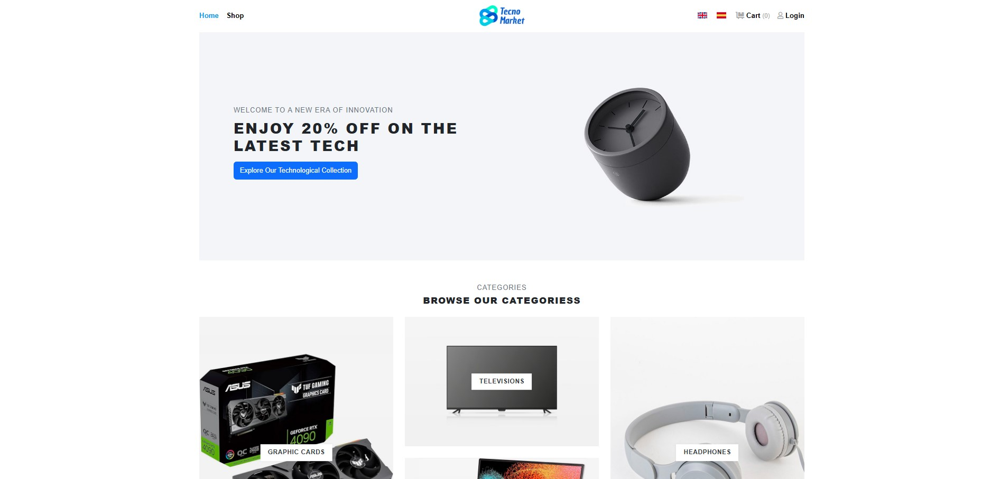
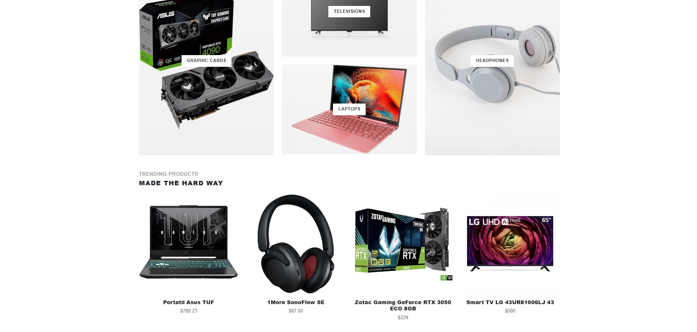

# TechShopWebApp

## Descripción

**TechShopWebApp** es una aplicación web de comercio electrónico desarrollada con **Laravel** y el motor de plantillas **Blade**, diseñada para gestionar productos, pedidos y clientes de manera eficiente.




## Tecnologías Utilizadas

- **Laravel**: Framework PHP para el desarrollo backend.
- **Blade**: Motor de plantillas para la vista.
- **MySQL**: Base de datos relacional para almacenamiento de información.
- **Bootstrap**: Framework CSS para la interfaz de usuario.
- **JavaScript (jQuery)**: Dinamización de la interfaz y manejo de eventos.

## Funcionalidades Principales

- **Autenticación de Usuarios**: Registro, inicio de sesión y recuperación de contraseña.
- **Gestión de Productos y Pedidos**: Creación, edición y eliminación de productos y pedidos.
- **Exploración de Categorías**: Organización de productos por categorías.
- **Carrito de Compras**: Funcionalidad para añadir, eliminar y modificar productos en el carrito.
- **Administración de Inventario**: Control de stock y disponibilidad de productos.
- **Procesamiento Seguro de Pedidos**: Manejo de pagos y confirmación de compras.

## Estructura del Proyecto

```
TechShopWebApp/
├── app/
│   ├── Http/
│   │   ├── Controllers/
│   │   ├── Middleware/
│   │   └── Requests/
│   ├── Models/
├── database/
│   ├── migrations/
│   ├── seeders/
├── public/
│   ├── assets/
│   ├── images/
├── resources/
│   ├── views/
│   │   ├── layouts/
│   │   ├── products/
│   │   ├── auth/
│   │   ├── cart/
│   ├── css/
│   ├── js/
├── routes/
│   ├── web.php
├── .env
├── composer.json
├── package.json
└── artisan
```

- **app/Http/Controllers/**: Controladores que manejan la lógica de la aplicación.
- **app/Models/**: Modelos de datos utilizados en la aplicación.
- **database/migrations/**: Migraciones para la estructura de la base de datos.
- **database/seeders/**: Datos iniciales para poblar la base de datos.
- **public/assets/**: Archivos estáticos como CSS y JS.
- **resources/views/**: Plantillas Blade organizadas por secciones.
- **routes/web.php**: Definición de rutas y endpoints de la aplicación.

## Conclusión

**TechShopWebApp** es una solución de comercio electrónico completa, construida con Laravel y Blade, que ofrece una experiencia fluida para la gestión de productos y pedidos. Su arquitectura modular permite escalabilidad y facilidad de mantenimiento.
